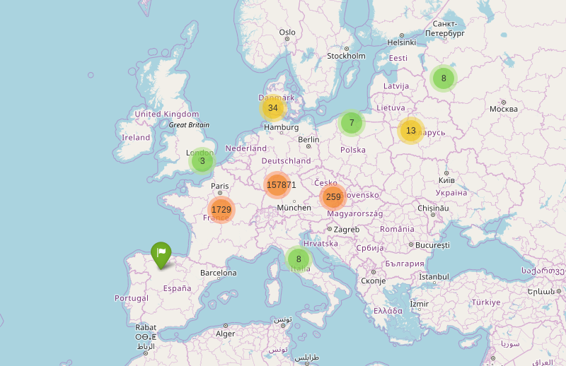
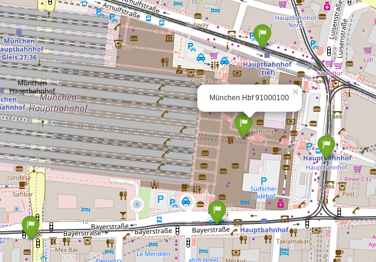

<h1> EFA_MAP

General:
-------
A map that provides station IDs for many public transport services in Europe.

Further EFA Projects to use the station IDs would be:

+ [EFA_Conky](https://github.com/TheNewCivilian/EFA-Conky)

+ [AVV_EFA_Timetable](https://github.com/TheNewCivilian/AVV_EFA_Timetable)

Screenshots:
-----------
Over 16000 stations in Europe (Map © OpenStreetMap contributors):

Station Name and ID (Map © OpenStreetMap contributors):

